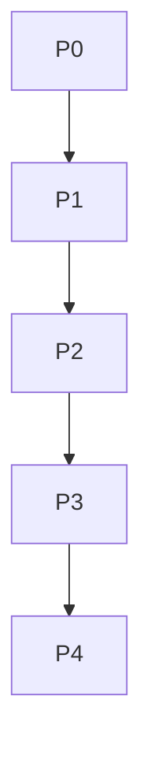

# Long renderer contract

This document must span more than three fixed-height viewports.

## Page material 1

The renderer calculates page count after all layout-affecting work settles.
Each requested page starts at an exact multiple of the logical viewport height.

```rust
let offset = page * viewport_height;
```

## Page material 2

The final partial page is padded only for scrolling, so it does not overlap the
preceding tile. Its unused lower area remains the document background.

| page | expected offset |
| ---: | ---: |
| 0 | 0 |
| 1 | 360 |
| 2 | 720 |

## Page material 3

Lorem ipsum dolor sit amet, consectetur adipiscing elit. Integer luctus,
libero in malesuada feugiat, neque nulla volutpat justo, vitae viverra sem
magna vitae massa. Sed non dolor ac erat cursus volutpat.

## Page material 4

Praesent feugiat, mauris sit amet faucibus vulputate, arcu risus pellentesque
erat, sed consequat lectus sapien vitae risus. Donec at nisi in urna tempor
convallis. Suspendisse potenti.

## Page material 5

Aliquam erat volutpat. Curabitur vitae malesuada sem. Phasellus accumsan,
metus at consequat vulputate, nibh nibh aliquam lorem, at luctus velit ligula
quis erat. Vivamus id augue quis nibh faucibus volutpat.

## Page material 6



## Page material 7

The renderer reports total pages in JSON, and an out-of-range request exits
with its dedicated status without leaving a partial PNG.

## Page material 8

End of the long fixture.
