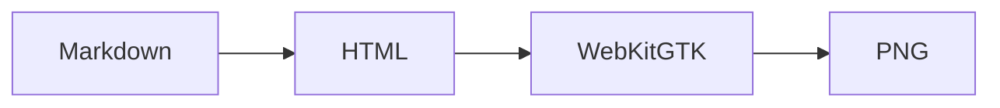

# Renderer contract

This fixture exercises **rich Markdown**, ==marked text==, inline math
$E = mc^2$, and a contained local image.


> [!NOTE]
> Screenshot readiness includes tables, alerts, syntax highlighting, math,
> diagrams, fonts, and images.

- [x] Parse Markdown
- [x] Enhance the DOM
- [ ] Capture the requested tile

| Surface | Owner | Result |
| --- | --- | --- |
| Renderer | md-preview | PNG plus JSON metadata |
| Preview lifecycle | Caller integration | Cache, seek, and display |

```rust
fn exact_page_offset(page: u32, height: u32) -> u32 {
    page * height
}
```

```bash
md-preview-render --input README.md --output tile.png --page 0 \
  --width 960 --height 540 --scale 2 --theme dark --timeout-ms 20000
```

$$
\int_0^1 x^2\,dx = \frac{1}{3}
$$


